# AI Network Anomaly Detection and Intrusion Intelligence Platform

A hardened, reproducible, deployment-ready cybersecurity AI capstone platform that combines supervised multi-class attack classification, unsupervised statistical anomaly detection, deterministic hybrid risk triage, persistent PostgreSQL telemetry, real-time native Zeek ingestion, and an interactive React SOC dashboard.

---

## 1. Core Architecture

The platform operates across two distinct, complementary ingestion pipelines:

```mermaid
flowchart TD
    subgraph "Stream 1: Validated ML PCAP Pipeline"
        PCAP["Raw PCAP / PCAPNG Upload"] --> RECON["dpkt Packet Parser &<br/>Flow Reconstructor"]
        RECON --> ADAPT["48-Feature Adapter<br/>(K=48 Canonical Schema)"]
        ADAPT --> XGB["XGBoost Classifier<br/>(9 Attack Families)"]
        ADAPT --> IF["Isolation Forest Anomaly Detector<br/>(Calibrated alpha=0.01)"]
        XGB --> HYBRID["Hybrid Risk Engine<br/>(CRITICAL, HIGH, MED, LOW)"]
        IF --> HYBRID
        HYBRID --> PERSIST_1["PostgreSQL Storage<br/>(SecurityEvents & Alerts)"]
    end

    subgraph "Stream 2: Real-Time Native Zeek Telemetry"
        ZEEK_SPOOL["Zeek IDS conn.log Spool"] --> TAILER["Asynchronous Spool Tailer<br/>(Offset Tracking)"]
        TAILER --> WORKER["Ingestion Worker<br/>(Micro-Batching & Checkpoint)"]
        WORKER --> PERSIST_2["PostgreSQL Storage<br/>(source_channel='ZEEK_CONN')"]
        WORKER --> SSE["EventBroadcaster<br/>(Server-Sent Events)"]
        SSE --> LIVE_DASH["React Live Dashboard<br/>('Telemetry Only' Invariant)"]
    end
```



---

## 2. Benchmark Machine Learning Performance (Stage 3)

All models were evaluated on the 2,827,761 verified flows of the CICIDS2017 dataset using strictly training-fitted scalers and zero test-set leakage.

### Protocol A (Stratified 70/15/15 Split, Primary $K=48$ Feature Set)
*Test Set Support: $N = 424,165$ flows*

| Model Architecture | Accuracy | Macro-F1 | Weighted-F1 | Binary FPR | Binary ROC-AUC | Inference Latency |
| :--- | :---: | :---: | :---: | :---: | :---: | :---: |
| **XGBoost (Production Default)** | **99.90%** | **88.53%** | **99.90%** | **0.12%** | **0.999961** | **7.35 μs/sample** |
| **Random Forest** | 99.78% | 85.14% | 99.81% | 0.26% | 0.999936 | 10.83 μs/sample |
| **Logistic Regression** | 86.14% | 52.60% | 90.36% | 17.11% | 0.983798 | 0.56 μs/sample |
| **Isolation Forest ($\alpha=0.01$)** | N/A | N/A | N/A | **0.998%** | 0.816510 | 20.74 μs/sample |

*Note: In Protocol A, 34,771 feature vectors are identical between train and test sets due to network burst replication. Protocol B cross-capture testing provides the rigorous out-of-session evaluation (see `docs/experiments/baseline_results_report.md`).*

---

## 3. Scientific Invariants & Research Findings

1. **Stage 9A Compatibility Finding**: Zeek connection logs do NOT achieve feature parity with CICFlowMeter 48-feature vectors (Stage 9A compatibility gate **FAILED** with 13.67% benign FPR and 0% agreement on DDoS attacks). Consequently, Zeek telemetry is ingested purely as **native connection metadata** without ML distortion.
2. **Model Immutability**: Stage 3 frozen model artifacts and calibrated decision thresholds ($\alpha=0.01, \theta=0.051838$) are strictly preserved.
3. **Fail-Fast Integrity Verification**: Container startup validates SHA-256 checksums of mounted model binaries before initializing inference.

---

## 4. Quickstart Deployment (Docker Compose)

### 1-Command Production Launch
```bash
# 1. Clone repository
cd i-x20

# 2. Copy environment template
cp .env.example .env

# 3. Launch multi-container platform (PostgreSQL + FastAPI + Nginx React SPA)
docker compose -f docker-compose.prod.yml up --build -d
```

### Access Platform Interfaces
- **SOC Analyst Dashboard**: `http://localhost`
- **Interactive API Documentation**: `http://localhost:8000/docs`
- **Health Liveness Probe**: `http://localhost/health/live`
- **Health Readiness Probe**: `http://localhost/health/ready`
- **Platform Metrics**: `http://localhost/api/v1/metrics`

---

## 5. Automated Demo Walkthrough

Run the automated interactive walkthrough script using curated demo assets in `data/demo/`:

```bash
python scripts/demo_walkthrough.py --base-url http://localhost:8000
```

The script verifies:
1. System readiness & model checksum verification
2. Single-flow AI evaluation (Benign HTTPS session)
3. PCAP attack detection (LOIC DDoS & Nmap PortScan)
4. Zeek native telemetry batch ingestion
5. Operational system metrics

---

## 6. Running Tests & Verification

```bash
# Run complete test suite (135 tests)
python -m unittest discover -s tests -p "test_*.py" -v

# Run backup/restore smoke test
python scripts/test_backup_restore.py

# Build frontend production bundle
cd frontend && npm run build
```

---

## 7. Documentation Index

- [`docs/deployment_guide.md`](docs/deployment_guide.md) — Comprehensive containerized deployment & model mounting guide
- [`docs/security_model.md`](docs/security_model.md) — Security headers, rate limiting, and threat model
- [`docs/operations_runbook.md`](docs/operations_runbook.md) — Troubleshooting runbook and incident response
- [`docs/capstone_presentation_guide.md`](docs/capstone_presentation_guide.md) — Technical presentation guide and supported scientific claims
- [`docs/stage_9b_realtime_zeek_architecture.md`](docs/stage_9b_realtime_zeek_architecture.md) — Real-time Zeek streaming and SSE architecture
- [`docs/experiments/stage_9a_zeek_compatibility_report.md`](docs/experiments/stage_9a_zeek_compatibility_report.md) — Stage 9A Zeek ML compatibility research report
