# Capstone Presentation & Evaluation Guide

This guide provides technical evaluators and reviewers with a comprehensive summary of the **AI Network Anomaly Detection and Intrusion Intelligence Platform**, including verified empirical benchmarks, scientific claim boundaries, and demonstration instructions.

---

## 1. System Architecture & Pipeline Flow

The platform implements two strictly separated, complementary telemetry streams:

```mermaid
flowchart TD
    subgraph "Stream 1: Validated ML Intrusion Detection"
        PCAP["Raw PCAP / PCAPNG"] --> RECON["dpkt Packet Parser &<br/>Flow Reconstructor"]
        RECON --> ADAPT["48-Feature Adapter<br/>(K=48 Selected Features)"]
        ADAPT --> XGB["XGBoost Supervised Classifier<br/>(9 Attack Families)"]
        ADAPT --> IF["Isolation Forest Anomaly Detector<br/>(Calibrated alpha=0.01)"]
        XGB --> HYBRID["Hybrid Risk Engine<br/>(4 Triage Tiers: CRITICAL, HIGH, MED, LOW)"]
        IF --> HYBRID
        HYBRID --> PERSIST_1["PostgreSQL Telemetry<br/>& SOC Alerts"]
    end

    subgraph "Stream 2: Real-Time Native Zeek Telemetry"
        ZEEK_SPOOL["Zeek IDS conn.log Spool"] --> TAILER["Asynchronous Spool Tailer<br/>(Offset Tracking)"]
        TAILER --> WORKER["Ingestion Worker<br/>(Micro-Batching & Dedup)"]
        WORKER --> PERSIST_2["PostgreSQL Storage<br/>(source_channel='ZEEK_CONN')"]
        WORKER --> SSE["EventBroadcaster<br/>(Server-Sent Events)"]
        SSE --> LIVE_DASH["React Live Dashboard<br/>(Telemetry Only Badge)"]
    end
```



---

## 2. Verified Empirical Benchmark Scorecard (Stage 3)

All model benchmarks were conducted on the verified CICIDS2017 flow dataset (2,827,761 valid flows across 8 capture files) strictly with training-set fitting and zero test-set leakage.

### Protocol A (Stratified 70/15/15 Split, Primary $K=48$ Feature Set)
*Test Set Support: $N = 424,165$ flows*

| Model Architecture | Accuracy | Macro-F1 | Weighted-F1 | Binary FPR | Binary ROC-AUC | Binary PR-AUC | Inference Latency |
| :--- | :---: | :---: | :---: | :---: | :---: | :---: | :---: |
| **Logistic Regression** | 86.14% | 52.60% | 90.36% | 17.11% | 0.983798 | 0.930457 | 0.56 μs/sample |
| **Random Forest** | 99.78% | 85.14% | 99.81% | 0.26% | 0.999936 | 0.999712 | 10.83 μs/sample |
| **XGBoost (Production Default)** | **99.90%** | **88.53%** | **99.90%** | **0.12%** | **0.999961** | **0.999834** | **7.35 μs/sample** |
| **Isolation Forest ($\alpha=0.01$)** | N/A | N/A | N/A | **0.998%** | 0.816510 | 0.629627 | 20.74 μs/sample |

### Protocol A XGBoost Per-Class Performance ($K=48$)
- `BENIGN`: 100.0% Precision / 99.9% Recall / **99.9% F1** (Support: 340,681)
- `BRUTE_FORCE`: 100.0% Precision / 100.0% Recall / **100.0% F1** (Support: 2,075)
- `DDOS`: 100.0% Precision / 100.0% Recall / **100.0% F1** (Support: 19,204)
- `DOS`: 99.8% Precision / 100.0% Recall / **99.9% F1** (Support: 37,759)
- `PORT_SCAN`: 99.4% Precision / 100.0% Recall / **99.7% F1** (Support: 23,821)
- `WEB_ATTACK`: 97.9% Precision / 99.7% Recall / **98.8% F1** (Support: 327)
- `BOT`: 62.4% Precision / 99.3% Recall / **76.7% F1** (Support: 293)
- `INFILTRATION`: 100.0% Precision / 20.0% Recall / **33.3% F1** (Support: 5)

---

## 3. Grounded Scientific Claims vs Prohibited Claims

### Scientifically Supported Claims
1. **Supervised Classification**: XGBoost achieves **99.90% Accuracy** and **88.53% Macro-F1** under Protocol A stratified evaluation.
2. **Benchmark Limitation Disclosure**: In Protocol A, 34,771 feature vectors are identical between train and test sets due to network burst traffic. Protocol B cross-capture testing rigorously evaluates true out-of-session generalization.
3. **Statistical Anomaly Calibration**: Isolation Forest calibrated at $\alpha=0.01$ achieves **0.998% benign FPR** with threshold $\theta=0.051838$.
4. **Hybrid Risk Engine**: Resolves classifier uncertainties into 4 actionable triage tiers (`CRITICAL`, `HIGH`, `MEDIUM`, `LOW`).
5. **Native Zeek Telemetry**: Ingests full Zeek conn.log metadata in real time via SSE without applying unvalidated ML models.

### Explicitly Prohibited Claims
1. **Do NOT claim Zeek features are compatible with CICFlowMeter K=48 ML models**: Empirically disproven in Stage 9A. Zeek-derived features caused 13.67% benign FPR and 0% agreement on DDoS attacks.
2. **Do NOT claim microsecond PCAP ingestion**: Python packet reconstruction operates at millisecond scale.
3. **Do NOT claim 100% detection on all zero-day attacks**.

---

## 4. Live Demonstration Walkthrough

To execute an automated end-to-end demonstration against a running deployment:

```bash
python scripts/demo_walkthrough.py --base-url http://localhost:8000
```

### Demonstration Steps:
1. **Health Verification**: Queries `/health/ready` to verify database connectivity and loaded model weights.
2. **Model Integrity Inspection**: Validates SHA-256 hashes of all active model binaries in `/api/v1/models`.
3. **Single-Flow Evaluation**: Submits `data/demo/demo_benign_flow.json` to `/api/v1/inference/evaluate` $\to$ demonstrates low risk score (0-15) and benign classification.
4. **PCAP Threat Detection**: Uploads `data/demo/demo_ddos_loic.pcap` and `data/demo/demo_portscan_nmap.pcap` $\to$ demonstrates automated flow extraction, XGBoost attack classification, anomaly scoring, and SOC alert persistence.
5. **Zeek Telemetry Ingestion**: Uploads `data/demo/demo_zeek_conn.log` $\to$ demonstrates native telemetry ingestion with explicit `"Telemetry Only — ML Classification Not Performed"` invariant.
6. **Operational Telemetry**: Queries `/api/v1/metrics` $\to$ displays process uptime, active models in RAM, and queue depth.
