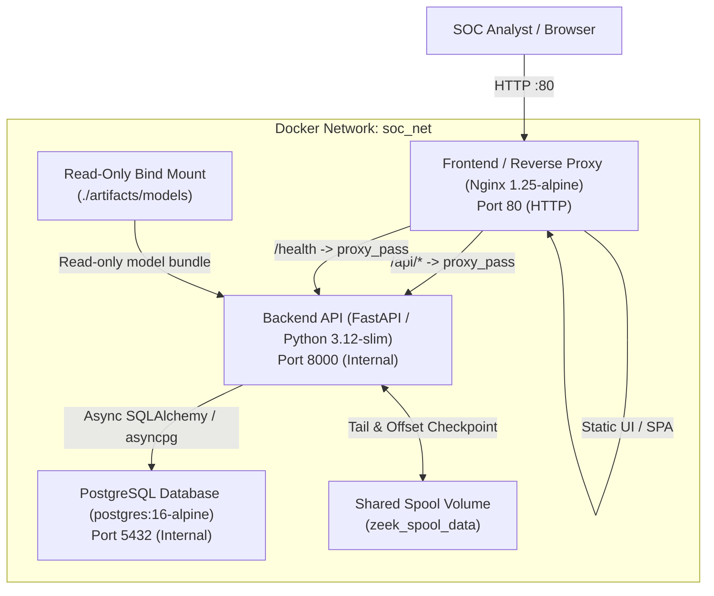

# Deployment & Infrastructure Guide: Stage 11

This guide provides comprehensive documentation for deploying, managing, and maintaining the **AI Network Anomaly Detection and Intrusion Intelligence Platform** using containerized Docker infrastructure and PostgreSQL persistence.

---

## 1. System Architecture Overview



### Container Services
1. **`postgres`** (`postgres:16-alpine`): Dedicated relational database container initializing with non-superuser role `soc_user` via `docker/postgres/init-db.sql`. Internal to `soc_net` in production.
2. **`backend`** (`Dockerfile.backend`): Multi-stage Python 3.12 container running as non-root `appuser` (UID 1000). Controlled via `docker/backend/entrypoint.sh` executing database wait-for loops, automated Alembic migrations, and model integrity checks.
3. **`frontend`** (`Dockerfile.frontend`): Multi-stage Node 20 build served by `nginx:1.25-alpine`. Reverse proxies `/api/` with SSE unbuffered streaming support (`proxy_buffering off; proxy_cache off;`).

---

## 2. Prerequisites & Environment Setup

### System Requirements
- Docker Engine 24.0+ & Docker Compose v2 (or Python 3.12 + Node 20 for host development)
- Frozen Stage 3 model artifacts present in `artifacts/models/`

### Environment Configuration (.env)
Copy the template and configure variables:
```bash
cp .env.example .env
```

Key configuration variables:
- `POSTGRES_DB`: Target database name (default: `soc_telemetry`)
- `POSTGRES_USER`: Application database user (default: `soc_user`)
- `POSTGRES_PASSWORD`: Database password
- `DATABASE_REQUIRED`: `true` for production, `false` for development
- `CORS_ORIGINS`: Comma-separated list of allowed origins
- `ENABLE_HTTPS`: Set `true` when behind TLS termination to emit HSTS headers
- `ZEEK_SPOOL_DIR`: Spool mount path (default: `/opt/zeek/spool/zeek`)

---

## 3. Launching the Stack

### Production Multi-Container Deployment (1 Command)
```bash
# Build and start all services in detached mode
docker compose -f docker-compose.prod.yml up --build -d

# Verify container health status
docker compose -f docker-compose.prod.yml ps
```

### Development Stack Launch
```bash
# Start development composition with exposed Postgres port (5432)
docker compose up --build -d
```

### Access Platform Endpoints
- **SOC Analyst Dashboard**: `http://localhost`
- **Interactive API Documentation**: `http://localhost:8000/docs` (or `http://localhost/api/docs`)
- **Health Liveness Probe**: `http://localhost/health/live`
- **Health Readiness Probe**: `http://localhost/health/ready`
- **Platform Telemetry Metrics**: `http://localhost/api/v1/metrics`

---

## 4. Frozen Model Artifact Provisioning & Integrity

> **CRITICAL INVARIANT**:
> Model binaries (`*.joblib`) are mounted **read-only** (`./artifacts/models:/app/artifacts/models:ro`). The backend container cannot modify or overwrite these files.

On startup, `docker/backend/entrypoint.sh` validates the SHA-256 checksums of required models:
- `protocol_a_xgboost_k48.joblib` (SHA-256: `7d9b78ff493f4ab0588022aeaef35bb02fd328751f52eb02e79ae7c488f50b89`)
- `protocol_a_isolationforest_k48.joblib` (SHA-256: `92cd85d0ece2f5a66df5442046ce9487f14551eaa9ee620d2e106132b880ad30`)

If models are missing or corrupted, startup fails immediately with an actionable error.

---

## 5. Database Migrations & Initialization

- **First Boot**: `docker/postgres/init-db.sql` runs on volume creation, configuring least-privilege permissions for `soc_user`.
- **Automated Migration**: `docker/backend/entrypoint.sh` executes `alembic upgrade head` on container launch before starting Uvicorn.
- **Manual Migration Commands**:
  ```bash
  # Check current revision
  docker compose -f docker-compose.prod.yml exec backend alembic current

  # Upgrade schema
  docker compose -f docker-compose.prod.yml exec backend alembic upgrade head
  ```

---

## 6. Database Backup and Restore Procedures

The platform provides operator scripts supporting compressed custom archives (`.dump`) and plain SQL:

### Database Backup
```bash
# Run backup script (creates ./backups/soc_telemetry_backup_YYYYMMDD_HHMMSSZ.dump)
python scripts/backup_db.py --output-dir ./backups --format custom

# Or execute inside Docker container:
docker compose -f docker-compose.prod.yml exec postgres \
    pg_dump -U soc_user -d soc_telemetry -Fc -f /tmp/backup.dump
```

### Database Restore
```bash
# Run restore script
python scripts/restore_db.py --backup-file ./backups/soc_telemetry_backup_20260831_100000Z.dump --clean

# Or execute inside Docker container:
docker compose -f docker-compose.prod.yml exec postgres \
    pg_restore -U soc_user -d soc_telemetry --clean --if-exists /tmp/backup.dump
```

---

## 7. Zeek Spool Permissions & Shared Volumes

- The Zeek spool volume `zeek_spool_data` is mounted at `/opt/zeek/spool/zeek`.
- The backend process runs as non-root `appuser` (UID 1000).
- `Dockerfile.backend` ensures directory permissions (`chown -R appuser:appuser /opt/zeek/spool/zeek`).
- When external Zeek engines write logs into the shared volume, ensure file permissions allow read access (`chmod 644 conn*.log`).

---

## 8. Troubleshooting & Diagnostics

| Symptom | Probable Cause | Action |
| :--- | :--- | :--- |
| **Backend exits immediately** | Database unavailable or model checksum mismatch | Inspect container logs: `docker compose -f docker-compose.prod.yml logs backend` |
| **SSE stream stalls** | Proxy buffering enabled | Verify Nginx config includes `proxy_buffering off; proxy_cache off;` |
| **Alembic migration failure** | Dirty database state | Run `alembic current` and resolve pending lock or down-revision |
| **Readiness probe returns 503** | Database disconnected or models not loaded | Check `GET /health/ready` response payload for specific component status |
