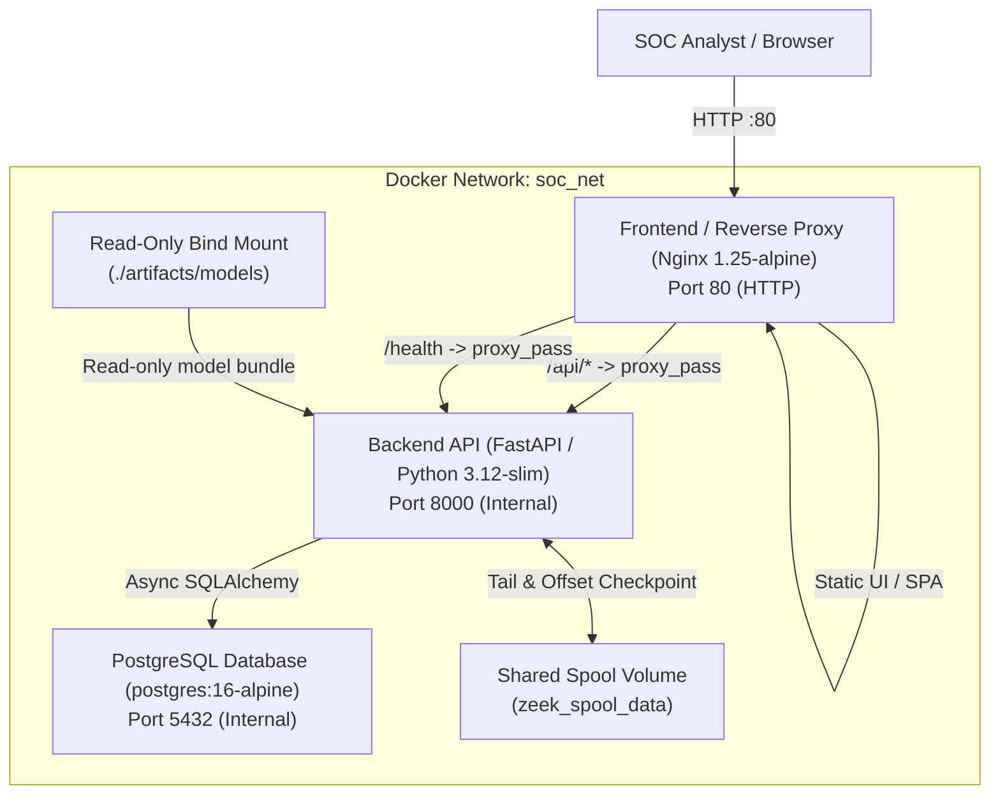

# Deployment Guide: Hardened Capstone Deployment

This document provides complete instructions for deploying the **AI Network Anomaly Detection and Intrusion Intelligence Platform** in a reproducible, hardened multi-container environment.

---

## 1. Architecture Overview

The platform uses a modular, containerized 3-tier architecture:



### Services
1. **`postgres`** (`postgres:16-alpine`): Relational persistence for analysis jobs, security events, flow provenance, model decisions, SOC alerts, and durable ingestion checkpoints.
2. **`backend`** (`Dockerfile.backend`): Python 3.12 FastAPI service executing packet reconstruction, ML inference (XGBoost + Isolation Forest), hybrid risk triage, and Zeek spool tailing.
3. **`frontend`** (`Dockerfile.frontend`): Static React SPA built with Vite and served via hardened Nginx with SSE unbuffered streaming proxy support.

---

## 2. Model Artifact Provisioning Strategy

> **CRITICAL INVARIANT**:
> The Stage 3 machine learning model binaries (`*.joblib`) are excluded from Git to prevent large binary repository bloat. They are provisioned into the container via a **read-only bind mount**.

### Mounting Configuration in `docker-compose.prod.yml`:
```yaml
volumes:
  - ./artifacts/models:/app/artifacts/models:ro
```

### Fail-Fast Integrity Verification
On container startup, the backend verifies that required model binaries exist and match their expected SHA-256 checksums:
- `protocol_a_xgboost_k48.joblib` (SHA-256: `7d9b78ff493f4ab0588022aeaef35bb02fd328751f52eb02e79ae7c488f50b89`)
- `protocol_a_isolationforest_k48.joblib` (SHA-256: `92cd85d0ece2f5a66df5442046ce9487f14551eaa9ee620d2e106132b880ad30`)

If any model file is missing or corrupted, container initialization **fails immediately with an explicit fatal error** rather than attempting to retrain or substitute models.

---

## 3. Quickstart Deployment (1 Command)

### Prerequisites
- Docker Engine 24.0+ & Docker Compose v2
- Frozen model artifacts present in `artifacts/models/`

### Launch Steps
```bash
# 1. Clone or navigate to the repository
cd i-x20

# 2. Copy and configure environment variables
cp .env.example .env

# 3. Build and launch all services in detached mode
docker compose -f docker-compose.prod.yml up --build -d

# 4. Verify running services and health status
docker compose -f docker-compose.prod.yml ps
```

Access the application:
- **SOC Analyst Dashboard**: `http://localhost`
- **Backend API Docs**: `http://localhost:8000/docs` (or via proxy `http://localhost/api/docs`)
- **Health Liveness Probe**: `http://localhost/health/live`
- **Health Readiness Probe**: `http://localhost/health/ready`

---

## 4. Local Development Setup (Without Docker)

### Backend (Python 3.12)
```bash
# 1. Create and activate virtual environment
python -m venv .venv
source .venv/bin/activate  # Or on Windows: .venv\Scripts\activate

# 2. Install dependencies
pip install -r backend/requirements.txt

# 3. Start PostgreSQL container
docker compose up -d postgres

# 4. Apply database migrations
cd backend
alembic upgrade head

# 5. Start development API server with reload
uvicorn app.main:app --host 0.0.0.0 --port 8000 --reload
```

### Frontend (Node 20)
```bash
cd frontend
npm install
npm run dev
# Dashboard available at http://localhost:5173
```

---

## 5. Database Migration & Maintenance

Database migrations are managed via Alembic. In containerized production, migrations run automatically on backend entry.

To inspect or manually run migrations:
```bash
# Inspect migration history
docker compose -f docker-compose.prod.yml exec backend alembic history

# Upgrade to latest migration head
docker compose -f docker-compose.prod.yml exec backend alembic upgrade head

# Check current revision
docker compose -f docker-compose.prod.yml exec backend alembic current
```

---

## 6. Backup and Restore Procedures

### Database Backup
```bash
docker compose -f docker-compose.prod.yml exec postgres \
    pg_dump -U soc_user -d soc_telemetry -F c -b -v -f /tmp/soc_backup.dump

# Copy backup dump to host machine
docker cp soc_telemetry_postgres:/tmp/soc_backup.dump ./soc_backup_$(date +%Y%m%d).dump
```

### Database Restore
```bash
# Copy dump file into postgres container
docker cp ./soc_backup.dump soc_telemetry_postgres:/tmp/soc_backup.dump

# Restore database
docker compose -f docker-compose.prod.yml exec postgres \
    pg_restore -U soc_user -d soc_telemetry --clean --if-exists -v /tmp/soc_backup.dump
```

---

## 7. Verification Audit Disclosure

- **Docker Deployment Smoke Test**: **UNVERIFIED** on host environments lacking Docker Engine / CLI.
- **Live PostgreSQL Backup/Restore Round-Trip**: **UNVERIFIED** on host environments lacking local `pg_dump` binary or live Docker daemon.

