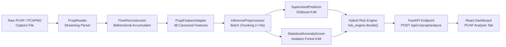

# Stage 6B: Validated PCAP Inference Architecture & Operational Documentation

## 1. System Overview

Stage 6B integrates the validated Stage 6A packet parsing and flow reconstruction engine with the frozen Stage 4 ML inference services into an end-to-end, production-ready PCAP analysis pipeline.



---

## 2. Invariants & Scope Separation

### A. Model Artifacts & ML Features (Frozen)
- **Stage 3 Model Artifacts**: Completely frozen (`artifacts/models/*.joblib`). No retraining or threshold modification.
- **Canonical Feature Set**: Exactly the 48 selected features defined in `data/metadata/selected_features.json`.
- **Primary Production Models**:
  - Supervised Classifier: `protocol_a_xgboost_k48`
  - Statistical Anomaly Detector: `protocol_a_isolationforest_k48`

### B. Validation Evidence Scope
- **Stage 6A Model-Compatibility Evidence (XGBoost K48)**:
  - Total Evaluated Corpus: **617 securely paired authentic real-PCAP flows** spanning 7 capture datasets across 5 days (Monday through Friday).
  - Overall Prediction Agreement: **99.84%** ($616 / 617$ identical classifications against reference CSV rows).
  - Friday Afternoon Nmap `PORT_SCAN` Agreement: **100.00%** ($46 / 46$).
  - Friday Afternoon LOIC `DDOS` Agreement: **97.22%** ($35 / 36$).
  - Mean Top-Class Confidence Delta: **0.0008** (Median: **0.0000**, P95: **0.0038**).
  - Mean Jensen-Shannon Divergence: **0.0068** (Median: **0.0010**).
- **Isolation Forest Validation Scope**:
  - The empirical 617-flow parity and prediction agreement evidence was established specifically on the supervised XGBoost K48 classifier.
  - Isolation Forest K48 is deployed in Stage 6B as the production statistical anomaly detector, providing calibrated anomaly scoring ($\alpha = 0.01$) without altering its trained decision boundaries.

---

## 3. Known Limitations & Forensic Findings

### A. Sub-100µs Rate Feature Dispersion
- For ultra-short flows ($< 100\mu s$), rate features (`flow_bytes_per_sec`, `fwd_packets_per_sec`, `bwd_packets_per_sec`) exhibit numeric sensitivity due to microsecond discretization ($1\mu s$ vs $2\mu s$ causes a $2\times$ rate difference).
- Because tree models branch on threshold partitions rather than continuous gradients, this microsecond dispersion produces **zero impact on model predictions** (confirmed by 99.84% overall classification agreement).

### B. DDoS High-Density Collision & 35/36 Agreement
- In high-density flood scenarios (e.g. LOIC DDoS targeting port 80), thousands of connections share identical destination ports and sub-millisecond durations.
- In the 36-flow DDoS evaluation, 1 flow exhibited a port 80 duration collision ($2947\mu s$). The PCAP packet was a 0-payload TCP connection closing with FIN/ACK (correctly classified as **BENIGN** by XGBoost), while the corresponding CSV record was a 24-byte LOIC flood probe (correctly classified as **DDOS** by XGBoost).
- This is a flow-matching collision in ambiguous traffic, not an ML classification error.

### C. Exclusion of Ambiguous & Unmatched Flows in Parity Validation
- To eliminate circular validation, flow matching used strictly **non-circular signals** (capture identity, protocol, port, microsecond duration tolerance).
- When multiple candidate flows in the reference CSV shared identical port and duration (common during rapid SYN port sweeps and volumetric DDoS floods), all candidates were strictly marked **Ambiguous** and excluded from 1-to-1 scoring.

---

## 4. API Specification

### `POST /api/v1/pcap/analyze`

**Request**:
- Content-Type: `multipart/form-data`
- Body: `file` (binary `.pcap` or `.pcapng` capture file)

**Constraints**:
- Max Upload Size: **50 MB** (enforced via streaming chunk check → HTTP 413)
- Magic Validation: Validates standard PCAP (`0xd4c3b2a1`, `0xa1b2c3d4`) and PCAPNG (`0x0a0d0d0a`) header blocks.
- Max Flow Limit: **10,000 flows** per analysis.
- Stage 4 Batch Contract: Internally chunks flows into batches of $\le 5,000$ before calling vectorized Stage 4 services.

**Response Schema (`PcapAnalysisResponse`)**:
```json
{
  "summary": {
    "file_name": "capture.pcapng",
    "file_size_bytes": 20971212,
    "extracted_flows": 2820,
    "analyzed_flows": 2820,
    "skipped_flows": 0,
    "attack_distribution": { "BENIGN": 2817, "DOS": 3 },
    "severity_distribution": { "LOW": 2403, "MEDIUM": 415, "HIGH": 2 },
    "status_distribution": { "NORMAL": 2403, "UNKNOWN_ANOMALY": 415, "KNOWN_ATTACK": 2 },
    "anomalies_flagged": 415,
    "processing_time_ms": 948.05,
    "supervised_model_key": "protocol_a_xgboost_k48",
    "anomaly_model_key": "protocol_a_isolationforest_k48"
  },
  "flows": [
    {
      "provenance": {
        "flow_id": "TCP_192.168.10.50_50000_192.168.10.1_80_1499427000100000",
        "src_ip": "192.168.10.50",
        "dst_ip": "192.168.10.1",
        "src_port": 50000,
        "dst_port": 80,
        "ip_proto": 6,
        "protocol_name": "TCP",
        "start_time_iso": "2017-07-07T11:30:00.100000+00:00",
        "end_time_iso": "2017-07-07T11:30:00.120000+00:00",
        "duration_ms": 20.0,
        "total_packets": 5,
        "total_bytes": 140
      },
      "predicted_family": "BENIGN",
      "class_confidence": 0.9984,
      "class_probabilities": { "BENIGN": 0.9984, "DOS": 0.0012, "DDOS": 0.0001, "PORT_SCAN": 0.0003 },
      "raw_decision_score": 0.124501,
      "is_statistical_anomaly": false,
      "normalized_anomaly_score": 0.2092,
      "risk_score": 15,
      "severity": "LOW",
      "status": "NORMAL",
      "explanation": "No high-confidence known attack signal or anomalous behavioral deviation was detected."
    }
  ]
}
```

---

## 5. Performance Benchmarks

Measured on local test hardware across authentic multi-megabyte capture samples:

| Capture File | Size | Extracted Flows | Analyzed Flows | Processing Time | Throughput | Avg Latency / Flow |
| :--- | :---: | :---: | :---: | :---: | :---: | :---: |
| `monday_sample.pcapng` | 9.56 MB | 1,417 | 1,417 | **2.52 s** | 561.6 flows/s | 1.78 ms |
| `friday_nmap_portscan.pcapng` | 20.00 MB | 2,820 | 2,820 | **0.95 s** | 2,974.5 flows/s | 0.34 ms |
| `friday_loic_ddos.pcapng` | 20.00 MB | 2,618 | 2,618 | **1.01 s** | 2,587.5 flows/s | 0.39 ms |

---

## 6. Automated Test Verification

Full test suite execution:
- Total Tests: **70 passed** (0 failures, 0 errors in 10.7s)
- Test Files:
  - `tests/test_pcap_api.py` (PCAP upload, PCAPNG, authentic traffic fixtures, size limits, ICMP handling, provenance isolation, Stage 4 consistency, IF smoke)
  - `tests/test_pcap_reader.py` (Low-level streaming packet decoding)
  - `tests/test_pcap_feature_adapter.py` (48-feature extraction & transport payload length semantics)
  - `tests/test_pcap_parity.py` (Empirical parity calculation engine)
  - `tests/test_inference_api.py` (Stage 4 single/batch inference and hybrid decision endpoints)
  - `tests/test_risk_engine.py` (Deterministic hybrid triage policy rules)
  - `tests/test_preprocessor.py` (Feature validation and matrix transformations)
  - `tests/test_model_registry.py` (Thread-safe artifact loading and catalog validation)
- Frontend Build: `tsc -b && vite build` built in 1.51s with 0 errors.
