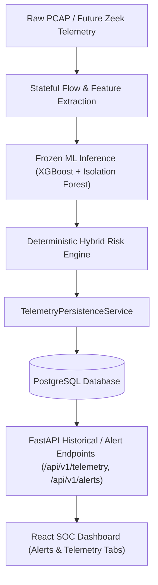
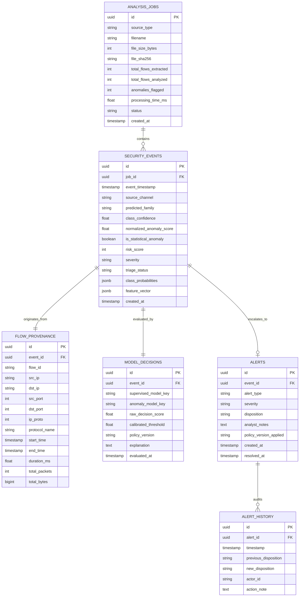

# Stage 7: Persistent Security Telemetry & Incident Management Architecture

## 1. System Overview

Stage 7 establishes a persistent security telemetry and incident-management layer backed by PostgreSQL and SQLAlchemy 2.0. It bridges real-time flow inference with durable relational storage for historical auditing, longitudinal trend analysis, and SOC alert lifecycle management.



---

## 2. Invariants & Scope Separation

### A. Frozen Stages Preserved
- **Stage 3 Models**: Completely frozen (`artifacts/models/*.joblib`). Zero retraining.
- **Stage 4 Inference**: Unaltered feature scaling, prediction, and anomaly scoring pipelines.
- **Stage 5 Dashboard**: In-memory session analytics preserved alongside persistent history.
- **Stage 6A/6B PCAP Inference**: 617-flow validation evidence and packet parsing logic unchanged.

### B. Downstream Persistence Contract
- Database persistence is strictly downstream of ML prediction and risk scoring.
- ML inference results and triage decisions are never altered by persistence failures.

### C. Explicit Failure Semantics
- When `DATABASE_REQUIRED=true`, database unavailability during application startup or request processing fails fast with an explicit error.
- When `DATABASE_REQUIRED=false`, the system operates in explicit ephemeral mode, returning ML inference results with `persisted: false` metadata.

---

## 3. Relational Schema & Entity Relationships



---

## 4. Key Architectural Features

### A. Immutable Detection Evidence
Detection evidence in `security_events`, `flow_provenance`, and `model_decisions` is strictly immutable once written. Analysts cannot modify original ML classifications, confidence scores, or feature snapshots.

### B. Configurable Alert Policy & Append-Only Audit Trail
- Security events only generate operational alerts when they meet the configurable alert policy (`ALERT_RISK_THRESHOLD`, `ALERT_CONFIDENCE_THRESHOLD`, `ALERT_ON_UNKNOWN_ANOMALY`).
- When an alert disposition changes (`OPEN` $\to$ `INVESTIGATING` $\to$ `RESOLVED` / `FALSE_POSITIVE`), the change is recorded in `alert_history` with the analyst ID, timestamp, and rationale.

### C. Primary Relational Indexing vs. Forensic JSONB Snapshots
- Primary queries, sorting, time-bounding, and subnet filtering operate on indexed relational columns (`event_timestamp`, `src_ip`, `dst_ip`, `predicted_family`, `risk_score`, `severity`, `triage_status`).
- The 48-feature vector is preserved in `feature_vector` as an immutable JSONB payload for detailed inspection without degrading index performance.

---

## 5. Docker & Migration Guide

### A. Starting Local PostgreSQL
```bash
# Start PostgreSQL 16 container via Docker Compose
docker compose up -d
```

### B. Executing Alembic Migrations
```bash
# Run schema upgrades to latest revision
alembic upgrade head
```

---

## 6. API Reference Summary

- `GET /api/v1/telemetry/events` — Query and filter historical security events with server-side pagination.
- `GET /api/v1/telemetry/events/{event_id}` — Retrieve full forensic event detail including 48-feature JSONB vector.
- `GET /api/v1/telemetry/jobs` — List historical PCAP/batch ingestion runs.
- `GET /api/v1/telemetry/jobs/{job_id}` — Inspect ingestion job summary and KPIs.
- `GET /api/v1/telemetry/stats/summary` — Aggregate security metrics over time windows (`1h`, `24h`, `7d`, `30d`, `all`).
- `GET /api/v1/alerts` — Query escalated incident alerts.
- `PATCH /api/v1/alerts/{alert_id}` — Update alert disposition with atomic audit trail appending.
- `GET /api/v1/health` — Reports API service and PostgreSQL persistence connectivity status.
