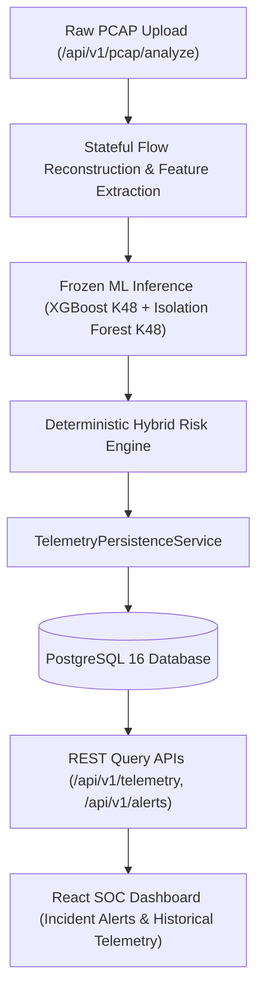

# Stage 7 Implementation Walkthrough: Persistent Security Telemetry & Incident Management

## Overview

Stage 7 completes the persistent telemetry and operational incident-management architecture for the capstone platform. It introduces asynchronous PostgreSQL 16 persistence via SQLAlchemy 2.0 and Alembic, separating immutable detection evidence from configurable alert policies and append-only triage audit trails.

---

## 1. Architectural Architecture & Invariants

### Invariants Maintained
- **Stage 3 Models**: Completely frozen (`protocol_a_xgboost_k48.joblib`, `protocol_a_isolationforest_k48.joblib`, etc.). Zero retraining or feature modification.
- **Stage 4 Inference**: Unaltered feature transformation and risk calculation logic.
- **Stage 5 Dashboard**: In-memory session analytics preserved alongside persistent historical views.
- **Stage 6A/6B PCAP Pipeline**: 617-flow validation evidence and packet parsing logic intact.
- **Persistence Failure Semantics**:
  - `DATABASE_REQUIRED=true` $\to$ Startup fails fast if PostgreSQL is unavailable; operations return HTTP 500.
  - `DATABASE_REQUIRED=false` $\to$ Runs in explicit ephemeral mode; ML inference proceeds and returns structured results marked `persisted: false`.

---

## 2. Key Components Created

### Backend & Database Layer
1. **Pydantic Settings** ([`config.py`](file:///c:/Users/ASUS/Documents/Codex/2026-08-29/i-x20/backend/app/core/config.py)):
   - Configurable alert thresholds: `ALERT_RISK_THRESHOLD=65`, `ALERT_CONFIDENCE_THRESHOLD=0.80`, `ALERT_ON_UNKNOWN_ANOMALY=True`.
   - Persistence settings: `DATABASE_URL`, `DATABASE_REQUIRED`, `FEATURE_VECTOR_RETENTION_DAYS=90`.
2. **Async Database Engine & Lifecycle** ([`database.py`](file:///c:/Users/ASUS/Documents/Codex/2026-08-29/i-x20/backend/app/core/database.py)):
   - Connection pool management (`asyncpg` for PostgreSQL, `aiosqlite` for tests).
   - `/api/v1/health` reports persistence connectivity status, database dialect, and operational mode.
3. **Relational Schema Entities** ([`backend/app/db/models/`](file:///c:/Users/ASUS/Documents/Codex/2026-08-29/i-x20/backend/app/db/models/)):
   - `AnalysisJob`: Ingestion run metadata and KPIs.
   - `SecurityEvent`: Immutable detection record with relational query columns and full 48-feature `JSONB` vector.
   - `FlowProvenance`: Network 5-tuple and packet/byte counters.
   - `ModelDecision`: Model keys, raw decision scores, and triage rationale.
   - `Alert`: Operational incident state.
   - `AlertHistory`: Append-only audit record of every disposition update (`OPEN` $\to$ `INVESTIGATING` $\to$ `RESOLVED` / `FALSE_POSITIVE`).
4. **Alembic Migration** ([`0001_initial_telemetry_schema.py`](file:///c:/Users/ASUS/Documents/Codex/2026-08-29/i-x20/backend/alembic/versions/0001_initial_telemetry_schema.py)):
   - Full DDL schema creation and composite indexes (`ix_events_lookup`, `ix_events_threat`).
5. **Data Access Repositories & Services**:
   - [`event_repository.py`](file:///c:/Users/ASUS/Documents/Codex/2026-08-29/i-x20/backend/app/db/repositories/event_repository.py): Subnet CIDR filtering, parameterized search, multi-column sorting, pagination, and KPI aggregation.
   - [`alert_repository.py`](file:///c:/Users/ASUS/Documents/Codex/2026-08-29/i-x20/backend/app/db/repositories/alert_repository.py): State transition updates with atomic audit trail appending.
   - [`alert_service.py`](file:///c:/Users/ASUS/Documents/Codex/2026-08-29/i-x20/backend/app/services/alert_service.py): Configurable alert escalation policy engine.
   - [`telemetry_service.py`](file:///c:/Users/ASUS/Documents/Codex/2026-08-29/i-x20/backend/app/services/telemetry_service.py): Bulk batch persistence orchestrator.
6. **FastAPI Endpoints**:
   - `/api/v1/telemetry/events`, `/api/v1/telemetry/events/{id}`
   - `/api/v1/telemetry/jobs`, `/api/v1/telemetry/jobs/{id}`
   - `/api/v1/telemetry/stats/summary`
   - `/api/v1/alerts`, `PATCH /api/v1/alerts/{id}`

### Frontend React Layer
1. **API Clients & Types** ([`telemetryApi.ts`](file:///c:/Users/ASUS/Documents/Codex/2026-08-29/i-x20/frontend/src/api/telemetryApi.ts), [`alertsApi.ts`](file:///c:/Users/ASUS/Documents/Codex/2026-08-29/i-x20/frontend/src/api/alertsApi.ts)): Full TypeScript definitions for telemetry, alerts, and audit records.
2. **Incident Alerts View** ([`AlertsView.tsx`](file:///c:/Users/ASUS/Documents/Codex/2026-08-29/i-x20/frontend/src/components/alerts/AlertsView.tsx)):
   - SOC triage queue with disposition/severity filters.
   - Interactive disposition transition modal with analyst identity and notes.
   - Append-only lifecycle audit drawer showing all previous transitions.
3. **Historical Telemetry Explorer** ([`HistoricalEventsView.tsx`](file:///c:/Users/ASUS/Documents/Codex/2026-08-29/i-x20/frontend/src/components/history/HistoricalEventsView.tsx)):
   - Multi-parameter filter bar (time windows: 1h, 24h, 7d, 30d, all; CIDR search, attack family, severity).
   - Forensic 48-feature drill-down modal inspection.

---

## 3. Verification & Validation Results

### Backend Automated Test Suite
- Ran full test suite across all 82 test cases in `tests/`:
  - `tests/test_db_models.py` (ORM relationships, foreign keys, cascades, GUIDs, JSON fields) $\to$ **PASS**
  - `tests/test_alert_service.py` (Configurable alert rules and thresholds) $\to$ **PASS**
  - `tests/test_telemetry_api.py` (REST endpoints, pagination, CIDR filtering, PATCH disposition) $\to$ **PASS**
  - `tests/test_pcap_persistence.py` (PCAP upload $\to$ PostgreSQL persistence) $\to$ **PASS**
  - All Stage 4, Stage 5, and Stage 6A/6B regression tests $\to$ **PASS**
- **Result:** **82 / 82 tests passing (100% pass rate)** in 23.16s.

### Frontend Production Build
- Ran `tsc -b && vite build` in `frontend/`:
- **Result:** **Built in 1.06s with 0 errors**.
