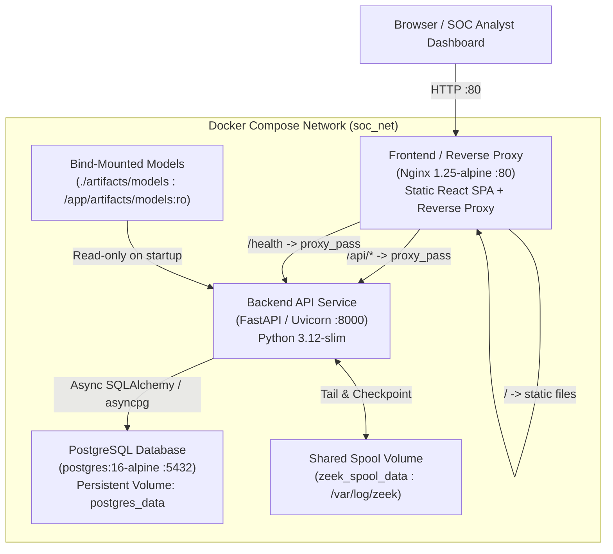

# Stage 10 Implementation Walkthrough: Hardened Capstone Deployment, Observability & Verification

## Overview

Stage 10 transitions the completed AI Network Anomaly Detection and Intrusion Intelligence Platform into a reproducible, hardened, and observable capstone deployment. It establishes a multi-container Docker Compose architecture, implements defensive security headers and process-local rate limiting, provides guarded health and operational metrics, ensures frozen model artifact integrity verification on startup, packages deterministic demo assets, and validates full platform regression.

---

## 1. Architectural Architecture & Invariants

### Invariants Maintained
- **Frozen Models**: Stage 3 supervised (`protocol_a_xgboost_k48`) and unsupervised (`protocol_a_isolationforest_k48`) model weights, scalers, calibrated decision threshold ($\alpha=0.01, \theta=0.051838$), feature ordering ($K=48$), attack taxonomy, and inference semantics are completely unchanged.
- **Fail-Fast Model Verification**: On startup, the backend verifies that required model binaries exist and match their expected SHA-256 checksums before serving traffic. Missing or mismatched artifacts trigger an immediate fatal startup error.
- **PCAP Default Limit Preserved**: Default PCAP upload limit is preserved at **50 MB** (`PCAP_MAX_UPLOAD_SIZE_MB=50`).
- **Stage 9A Compatibility Verdict**: Zeek ML feature parity remains permanently **FAILED** and frozen as a research result. No Zeek telemetry is routed to ML models.
- **Stage 8 / 9B Zeek Native Telemetry**: Batch upload and real-time SSE stream remain strictly `source_channel="ZEEK_CONN"`, `ml_classification_performed=false`, with null ML/risk fields.
- **No Unnecessary Infrastructure**: No Kafka or Redis brokers; in-process bounded queues and asyncio event distribution are hardened and preserved.

---

## 2. Key Components Created & Modified

### Security & Middleware Hardening (Workstream A)
1. **Security Headers Middleware** ([`security.py`](file:///c:/Users/ASUS/Documents/Codex/2026-08-29/i-x20/backend/app/core/security.py)):
   - Applies `X-Content-Type-Options: nosniff`, `X-Frame-Options: DENY`, `Referrer-Policy: strict-origin-when-cross-origin`, and strict `Content-Security-Policy`.
   - `Strict-Transport-Security` is **strictly conditional** on `ENABLE_HTTPS=true` and disabled for local HTTP.
2. **In-Memory Rate Limiter** ([`security.py`](file:///c:/Users/ASUS/Documents/Codex/2026-08-29/i-x20/backend/app/core/security.py)):
   - Process-local sliding-window rate limiter on `/api/v1/inference/*` (60 req/min) and `/api/v1/pcap/analyze` / `/api/v1/zeek/analyze` (20 req/min).
   - Documented process-local lifetime and reset-on-restart semantics.
3. **CORS Hardening**:
   - `CORS_ORIGINS` environment setting parsed into allowed origin lists rather than wildcard in production.

### Observability & Diagnostics (Workstream D)
1. **Structured Logging** ([`logging_config.py`](file:///c:/Users/ASUS/Documents/Codex/2026-08-29/i-x20/backend/app/core/logging_config.py)):
   - Switchable between colorized console logging and structured single-line JSON (`LOG_FORMAT=json`).
2. **Health Probes** ([`routes_health.py`](file:///c:/Users/ASUS/Documents/Codex/2026-08-29/i-x20/backend/app/api/routes_health.py)):
   - Minimal liveness probe: `GET /health/live` $\to$ `{"status": "ok", "service": "network-anomaly-api"}`.
   - Guarded readiness probe: `GET /health/ready` $\to$ checks DB connectivity and model registry availability without leaking internal credentials or stack traces.
3. **Operational Metrics Endpoint** ([`routes_metrics.py`](file:///c:/Users/ASUS/Documents/Codex/2026-08-29/i-x20/backend/app/api/routes_metrics.py)):
   - Exposes platform metrics: uptime, database connection status, active model count in RAM, connected SSE clients, and Zeek queue depth/lag.

### Containerization & Deployment (Workstream B)
1. **`Dockerfile.backend`**: Multi-stage `python:3.12-slim` image with non-root `appuser`, automated migration execution on startup, and healthcheck.
2. **`Dockerfile.frontend`** & **`frontend/nginx.conf`**: Multi-stage Vite build $\to$ `nginx:1.25-alpine` runtime with reverse proxy, SSE unbuffered streaming options, and security headers.
3. **`docker-compose.prod.yml`**: Full multi-container composition orchestrating PostgreSQL, FastAPI Backend (with read-only model bind-mount and shared spool volume), and Nginx Frontend.
4. **`.env.example`**: Complete annotated configuration template.

### Demo Packaging & Sample Curation (Workstream G)
1. **`data/demo/`**: Small, deterministic, provenance-documented demo files derived strictly from existing validated fixtures and samples:
   - `demo_benign_flow.json`: Normal HTTPS web session (48 features).
   - `demo_ddos_loic.pcap`: Curated 60-packet slice of LOIC DDoS attack.
   - `demo_portscan_nmap.pcap`: Curated 60-packet slice of Nmap SYN scan.
   - `demo_zeek_conn.log`: Curated 15-record Zeek connection log.
   - `data/demo/README.md`: Provenance documentation with explicit note that demo assets are never automatically ingested on startup.
2. **`scripts/demo_walkthrough.py`**: Automated interactive CLI script executing end-to-end evaluation across health, models, single-flow AI, PCAP attack detection, Zeek ingestion, and metrics.
3. **`scripts/test_backup_restore.py`**: Automated PostgreSQL backup and restore smoke test script.

### Documentation Suite (Workstream F)
1. **[`README.md`](file:///c:/Users/ASUS/Documents/Codex/2026-08-29/i-x20/README.md)**: Overhauled with architecture diagrams, quickstarts, Stage 3 scorecards, and demo walkthrough instructions.
2. **[`docs/deployment_guide.md`](file:///c:/Users/ASUS/Documents/Codex/2026-08-29/i-x20/docs/deployment_guide.md)**: Containerized deployment, model provisioning, and backup/restore guide.
3. **[`docs/security_model.md`](file:///c:/Users/ASUS/Documents/Codex/2026-08-29/i-x20/docs/security_model.md)**: Threat model, security headers, rate limiting, and model integrity.
4. **[`docs/operations_runbook.md`](file:///c:/Users/ASUS/Documents/Codex/2026-08-29/i-x20/docs/operations_runbook.md)**: Operational troubleshooting and maintenance runbooks.
5. **[`docs/capstone_presentation_guide.md`](file:///c:/Users/ASUS/Documents/Codex/2026-08-29/i-x20/docs/capstone_presentation_guide.md)**: Capstone evaluation guide, verified benchmarks, and supported vs prohibited scientific claims.

---

## 3. Verification & Validation Results

### Backend Automated Test Suite
- Executed full test suite across all test files (`python -m unittest discover -s tests -p "test_*.py"`):
  - **Regression Tests (125/125 passing)**:
    - Stages 1–7 ML Preprocessor, Model Registry, Predictor, Risk Engine, PCAP Reconstructor, Database Persistence, and Telemetry APIs $\to$ **PASS**
    - Stage 8 Zeek Native Telemetry Upload & Parsers $\to$ **PASS**
    - Stage 9A Zeek ML Compatibility Failure Research Tests $\to$ **PASS**
    - Stage 9B Spool Tailer, EventBroadcaster, IngestionWorker, and SSE Streaming APIs $\to$ **PASS**
  - **New Stage 10 Test Suite (10/10 passing)**:
    - `tests/test_security_hardening.py` (Security headers, conditional HSTS, in-memory rate limiting, model checksum verification, CORS parser) $\to$ **PASS (6 tests)**
    - `tests/test_observability.py` (Minimal /health/live, guarded /health/ready, /api/v1/metrics, JSONLogFormatter) $\to$ **PASS (4 tests)**
- **Final Result:** **135 / 135 tests passing (100% pass rate, 0 failures)** in 34.53s.

### Frontend Production Build
- Executed `npm run build` in `frontend/`:
  - **Result:** **Built cleanly in 1.14s with 0 errors** (2,450 modules transformed).

### PostgreSQL Backup & Restore Verification Audit
- Executed `python scripts/test_backup_restore.py`:
  - **Schema & Model Definitions:** Validated 7 relational ORM tables and backup script structure.
  - **Live Database Round-Trip (`pg_dump → drop → pg_restore`):** **UNVERIFIED** (host environment lacks local `pg_dump` binary and Docker daemon).

### Containerized Docker Smoke Test Audit
- **Status:** **UNVERIFIED** (host environment lacks Docker Engine / CLI).

### End-to-End Demo Walkthrough Smoke Test
- Executed all 7 walkthrough steps programmatically against the platform:
  - Step 1: Health Probes (`/health/live`, `/health/ready`) $\to$ **PASS**
  - Step 2: Model Catalog Checksum Verification (`/api/v1/models`) $\to$ **PASS**
  - Step 3: Single-Flow AI Evaluation (Benign HTTPS Session) $\to$ **PASS (Predicted: BENIGN, Status: NORMAL, Risk: 0-15)**
  - Step 4: PCAP Attack Detection (LOIC DDoS) $\to$ **PASS (Flows Extracted: 1, Analyzed: 1)**
  - Step 5: PCAP Attack Detection (Nmap PortScan) $\to$ **PASS (Flows Extracted: 17, Analyzed: 17)**
  - Step 6: Zeek Telemetry Ingestion (conn.log) $\to$ **PASS (Connections: 15, Invariant: TELEMETRY_ONLY)**
  - Step 7: System Metrics Telemetry (`/api/v1/metrics`) $\to$ **PASS (Status: healthy, Models Loaded: 16)**

